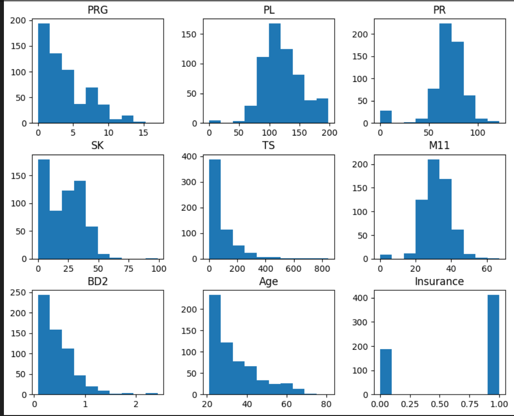
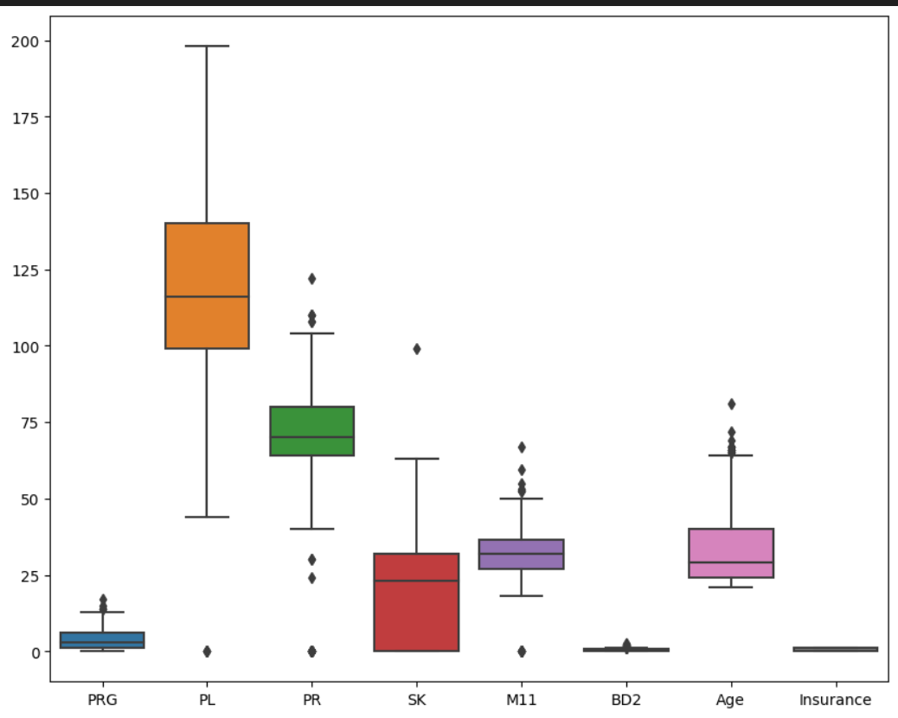
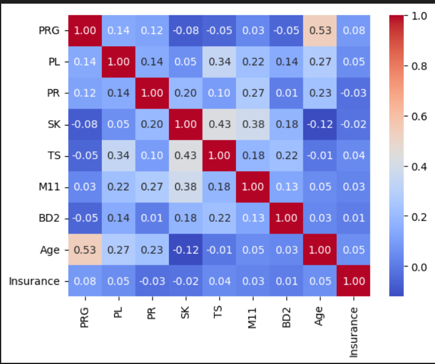
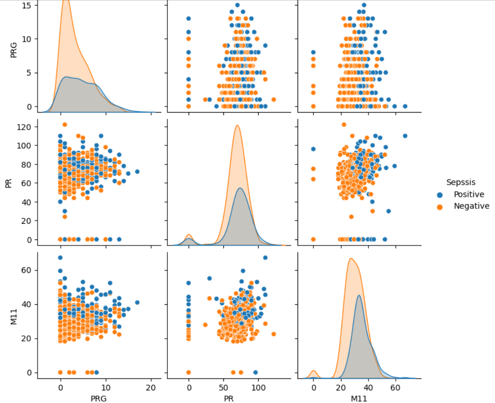
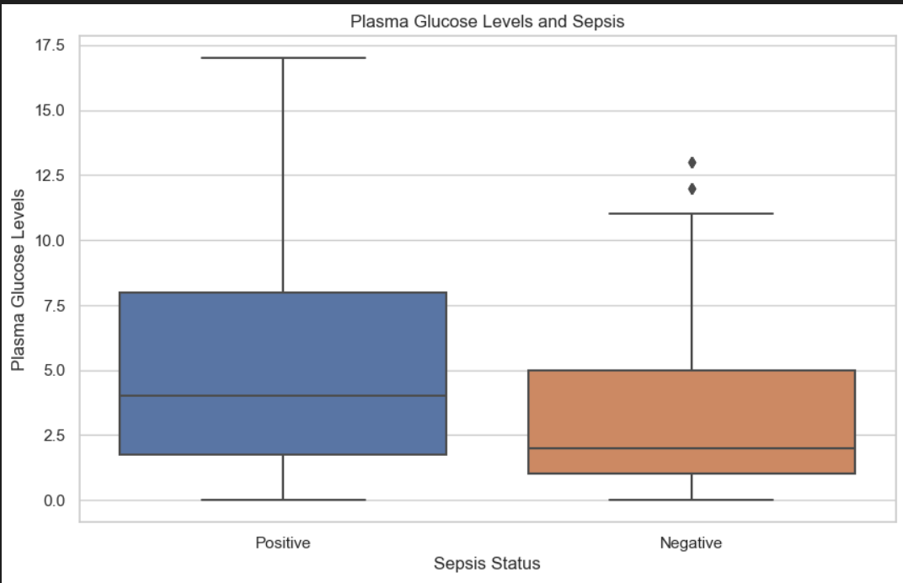
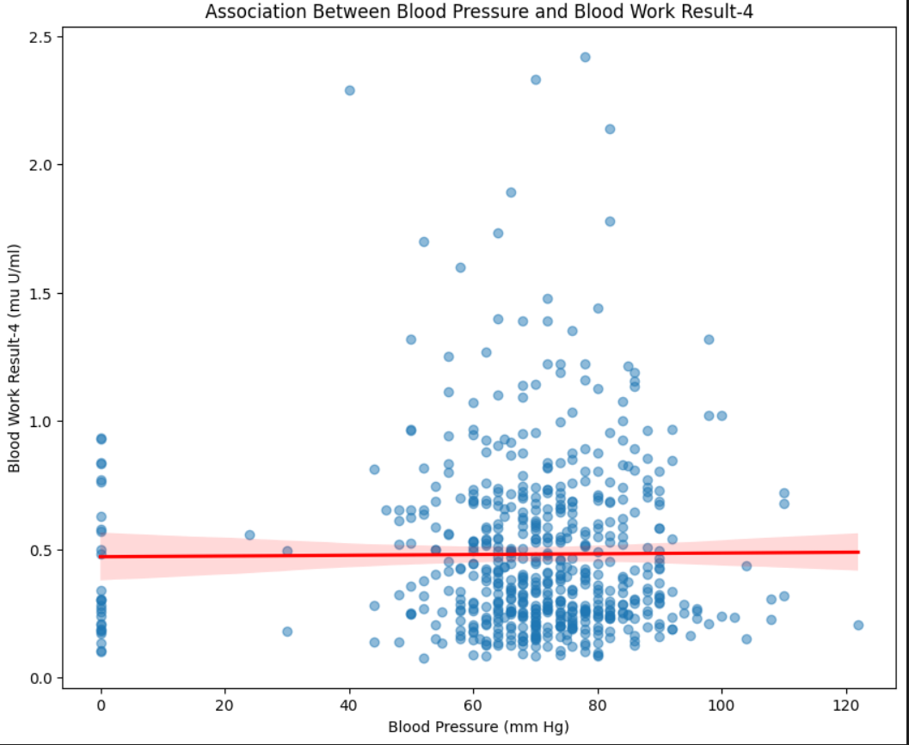
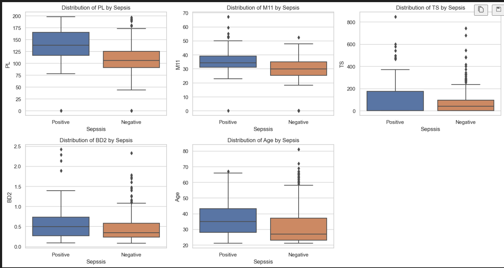
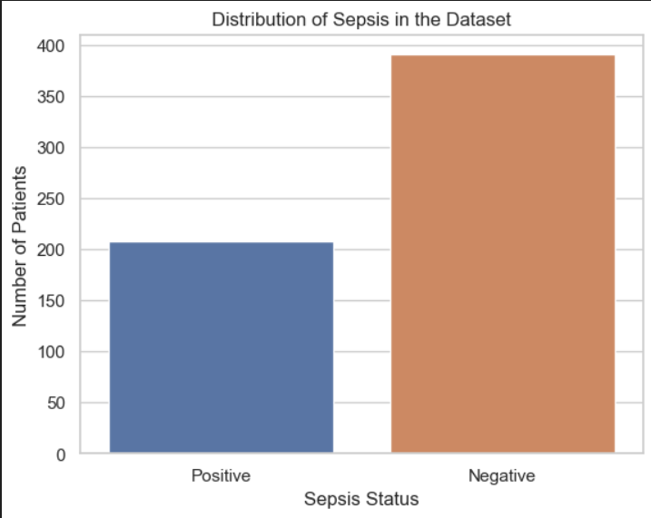

# P6
FastApi

# Introduction 
Fast API is a modern, fast (high-performance), web framework for building APIs with Python 3.7+ based on standard Python type hints. It is designed to be easy to use and to provide high performance while maintaining simplicity. Some key features of Fast API include:

1. Fast: It is built on top of Starlette and Pydantic, leveraging the latest Python type hints to enable fast development and automatic validation.
2. Asynchronous Support: Fast API is built with support for asynchronous programming, allowing you to use Python’s async and await to write asynchronous code for improved performance.
3. Data Validation: It uses Pydantic models for data validation, serialization, and documentation. This allows you to define the data shapes in your API using Python type hints.
4. Dependency Injection System: Fast API has a powerful dependency injection system that helps organize and manage the dependencies of your application.
5. Security Features: It includes features for handling security concerns such as automatic validation of request and response data, OAuth2 and JWT authentication, and more. 

## Summary
| Code      | Name        | Published Article |  Deployed App |
|-----------|-------------|:-------------:|------:|
| P6  | Medium |  [https://medium.com/@benmanks2015/fast-api-sepsis-analysis-app-b5db34adcc35](/) | [Best Article Machine learning](/) |
| P6  | docker-hub|  [https://hub.docker.com/repository/docker/benmanks/sepsis-api/general](/) | [Interative docker hub](/) |

## Project Description
-Sepsis, a life-threatening condition triggered by the body’s extreme response to an infection, stands as a formidable challenge in the realm of healthcare. This syndrome, often elusive in its early stages, can rapidly progress, leading to severe complications and, in severe cases, even death. As a major cause of morbidity and mortality worldwide, sepsis demands swift and accurate intervention.

In the face of this healthcare crisis, the importance of early detection cannot be overstated. Timely recognition of sepsis symptoms and prompt initiation of appropriate treatment can significantly improve patient outcomes, reducing the risk of complications and enhancing the chances of survival.

### Univariate Analysis 

### Bivariate 

### Multivariate Analysis 

## Hypothesis development 

✨ Null Hypothesis: There is no significant difference in plasma glucose levels between patients who develop sepsis and those who do not.

✨ Alternative Hypothesis: There is a significant difference in plasma glucose levels between patients who develop sepsis and those who do not.

## Business questions
1. Is there a relationship between plasma glucose levels and the development of sepsis?

2. What factors are associated with higher blood pressure in the ICU setting?

3. Are there specific factors (e.g., blood work results, BMI, age) associated with the development of sepsis?

4. What is the correlation between plasma glucose levels and other clinical variables in the dataset?

## Setup
1. **Clone the repository:**

   git clone mancatha/P6: FastApi (github.com) 

2. Navigate to the project directory:
    cd P6

3. Install required dependencies:
    pip install -r requirements.txt

4. Download the dataset:
    Download the Sepsis dataset from the data folder and place it in the data directory. 

5. Run the analysis:
    Depending on your preferred IDE or notebook environment, open and run the provided Jupyter Notebook or Python scripts. 

6. Evaluate models:
    After training and tuning models, evaluate them using the evaluation dataset. You can use the provided evaluation script or notebook.

7. Export the best model:
    If desired, export the best trained model using the provided export script.

## App Execution
To use the exported best model for predictions:
1. Load the exported model:
In your Python script or notebook, load the saved model using joblib:
import joblib

loaded_model = joblib.load('model\model.joblib')

2. Make predictions:
Use the loaded model to make predictions on new data:
new_data = ...  # Prepare your new data
predictions = best_model.predict(new_data)

## Appreciation
-   I highly recommend Azubi Africa for their comprehensive and effective programs. Read More articles about https://medium.com/@azubiafrica and take a few minutes to visit this link to learn more about Azubi Africa life-changing https://bit.ly/41CGCwK

-  **Tags**

https://bit.ly/3ARq742

## Author
`Benedicta Mankata`

`Data Analyst`

`Azubi Africa` 
